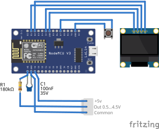
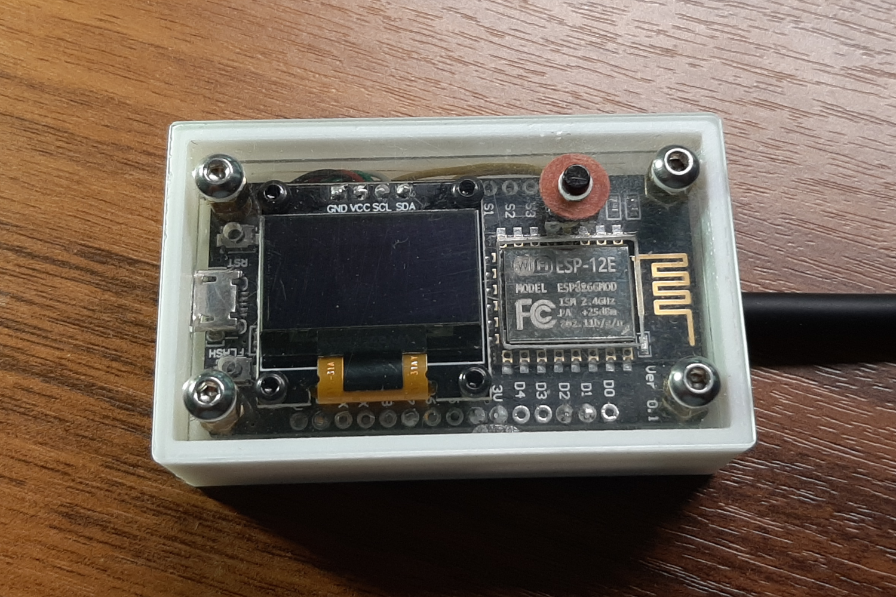
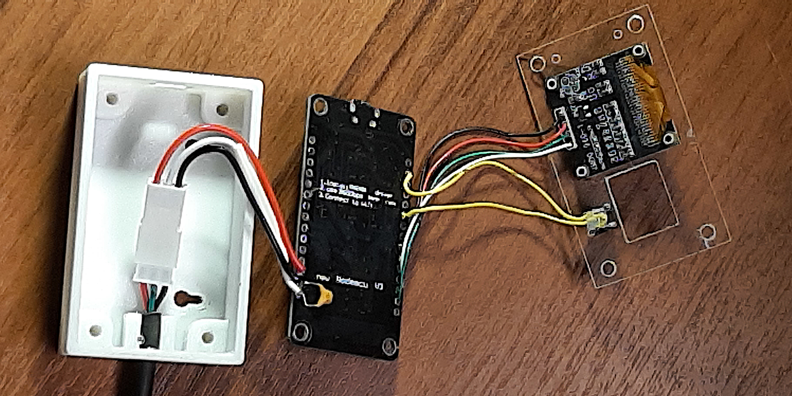
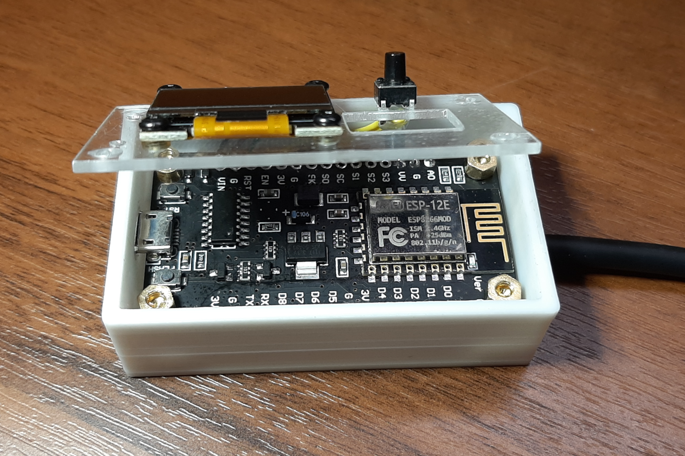
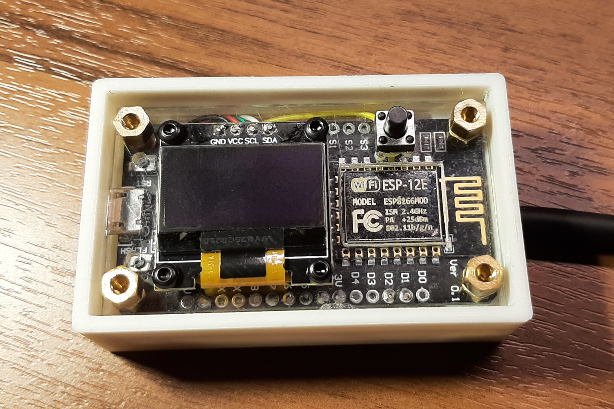
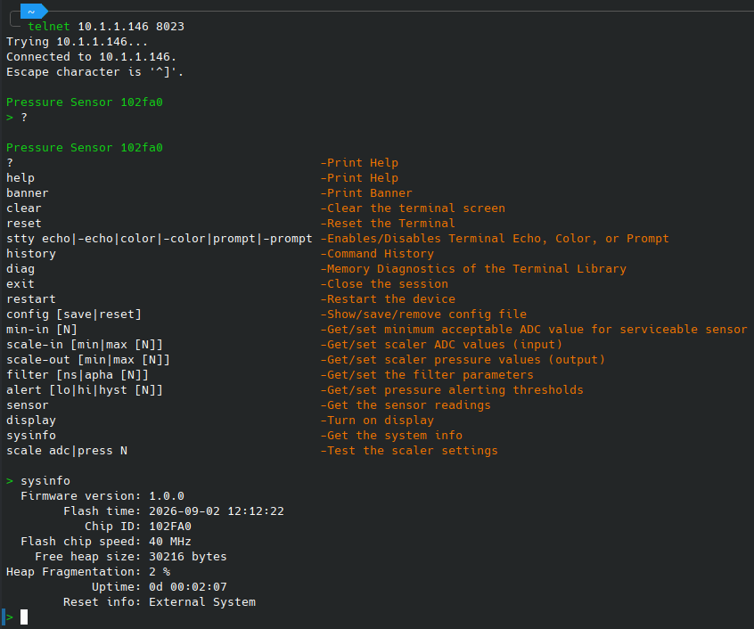
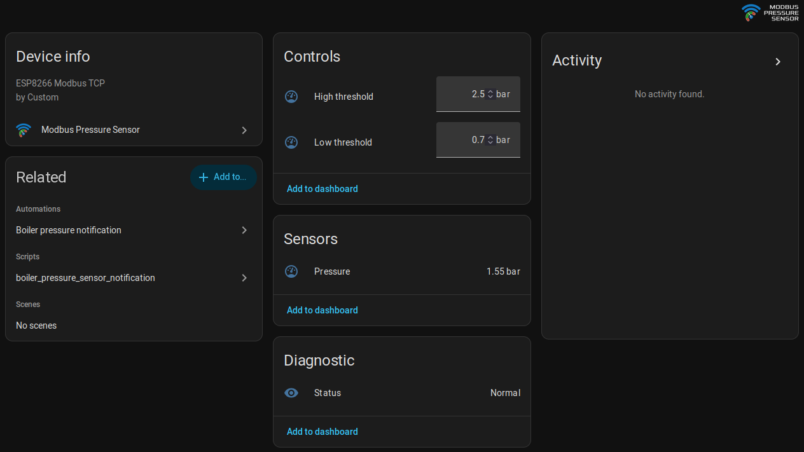

<H1>
<picture>
    <source media="(prefers-color-scheme: dark)" srcset="images/icon_dark.svg" width="80" />
    <source media="(prefers-color-scheme: light)" srcset="images/icon.svg" width="80" />
    
</picture>
The Modbus Pressure Sensor
</H1>

## The Project's goal

The project is designed to continuously monitor coolant pressure in a residential home's heating system using Home Assistant.

## The Project's Prototype

This project is based on [Датчик давления воды для умного дома](https://www.drive2.ru/c/718805452854398890/)

## Features

* **Continuous pressure monitoring:** Tracks coolant pressure and publishes it via an integrated Modbus server.
* **Status register:** Indicates sensor failure or user-defined pressure threshold violations.
* **Integrated Telnet server:** Allows for easy remote monitoring, debugging, and configuration.
* **Custom integration for Home Assistant:** Configurable Python-based sensor integration and YAML-based alerting automation.

## Schematic

### Breadboard View

 

### Schematic Diagram

 
<picture>
    <source media="(prefers-color-scheme: dark)" srcset="images/schematic_dark.svg" width="600" />
    <source media="(prefers-color-scheme: light)" srcset="images/schematic_light.svg" width="600" />
    
</picture>

The [Fritzing project file](hardware/schematics/fritzing/Sensor.fzz) can be found in `schematic` folder.

## Assembly

 

  
More pictures

  
   
   
   

## Firmware

The sensor's firmware is developed in C++ using the [VSCode PlatformIO add-on](https://platformio.org/).

### Telnet output example:

### Used Arduino Libraries

* [Adafruit_SSD1306](https://github.com/adafruit/Adafruit_SSD1306) by Adafruit
* [ArduinoJson](https://github.com/bblanchon/ArduinoJson) by Benoit Blanchon
* [modbus-esp8266](https://github.com/emelianov/modbus-esp8266) by Andre Sarmento Barbosa and Alexander Emelianov
* [Terminal](https://github.com/johngavel/Terminal) by John J. Gavel
* [WiFiManager](https://github.com/tzapu/WiFiManager) by tzapu

## Home Assistant Integration

### Modbus Sensor Integration

The integration provides the Modbus Pressure Sensor device and entities to Home Assistant.

#### Installation

1. **Copy the component folder:** Copy the  `hass/custom_components/modbus_pressure_sensor` directory into your
`<hass volume>/custom_components/` directory.
2. **Restart Home Assistant:** Navigate to `Settings` ➞ `System` ➞ `⁝` (top right) ➞ `Restart Home Assistant` ➞ `Restart`.
3. **Configure the device:** Once Home Assistant restarts, navigate to `Settings` ➞ `Devices & Services` ➞ `Add Intergration` 
➞ search for `Modbus Pressure Sensor` and input your `Host`, `Port`, and `Device ID` in the configuration window.
4. **Verify connection:** Check the newly created sensor entities to confirm successful data transmission.

 

### Alerting Automation (Optional)

This automation triggers notifications for the following events based on the status register:

* **Low pressure:** The pressure drops below the minimum threshold.
* **High pressure:** The pressure exceeds the maximum threshold.
* **Sensor failure:** The sensor reports an internal hardware error.
* **Sensor unavailable:** The sensor loses connection or stops reporting data.
* **Normal operation**: The pressure returns to the safe, standard range.

#### Installation

1. **Copy the configuration file:** Copy the `hass/packages/boiler_pressure_sensor.yaml` file into your `<hass volume>/packages/` directory.
2. **Reload configuration:** Navigate to `Settings` ➞ `⁝` (top right) ➞ `Restart Home Assistant` ➞ `Quick reload`.

## Other Useful Info

* [How to Fix Noisy Sensor Readings: Filtering Techniques for Arduino](https://zbotic.in/how-to-fix-noisy-sensor-readings-filtering-techniques-for-arduino/)
